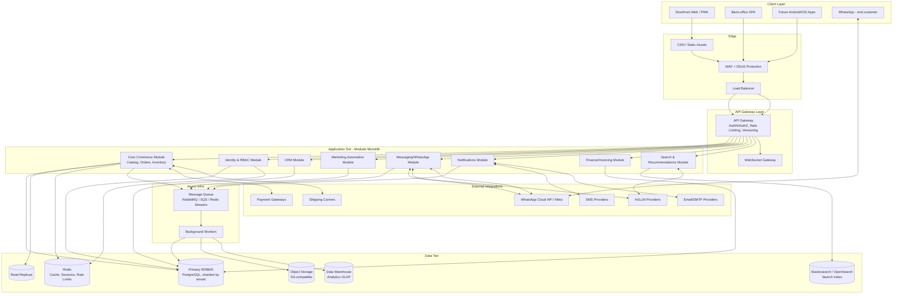
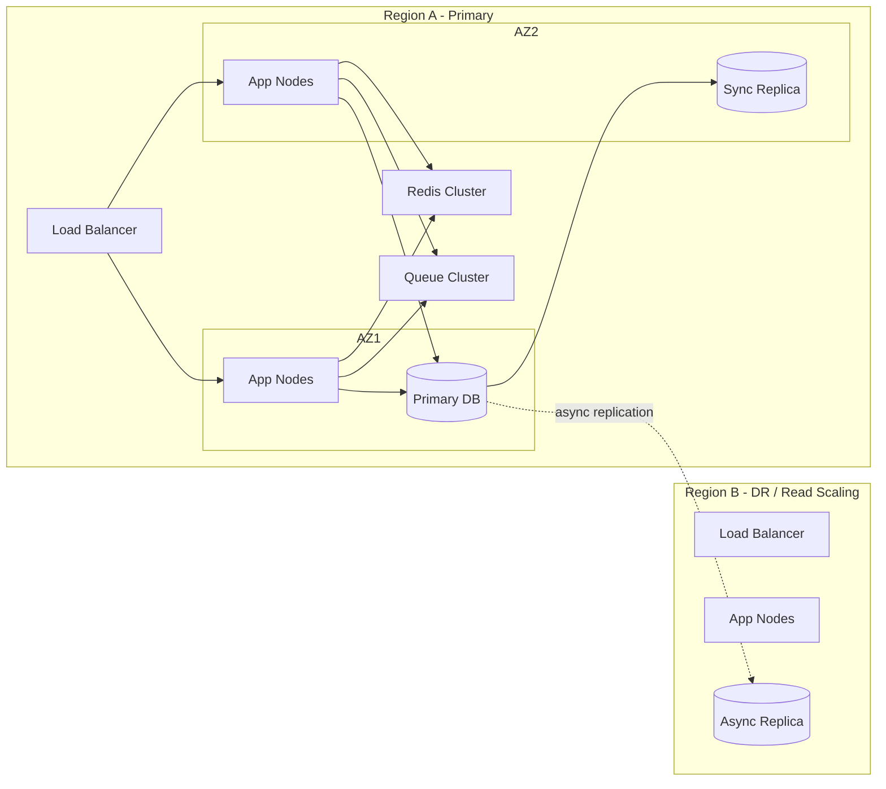
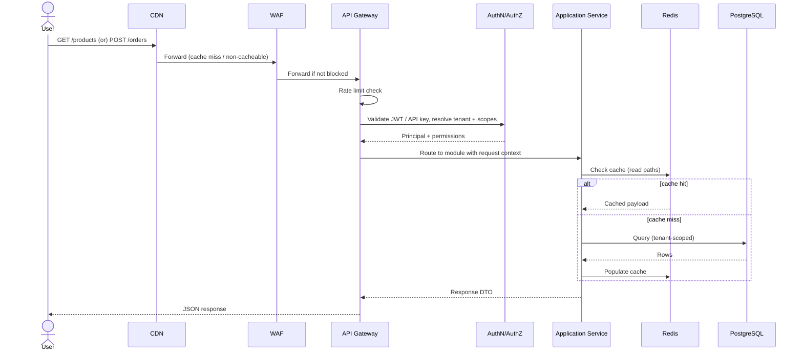

# 01 — System Architecture

**Document:** Nexo Platform SRS — Chapter 1
**Status:** Baseline for implementation
**Audience:** Engineering leadership, backend/frontend/infra teams, DevOps, security

---

## 1.1 Purpose and Architectural Goals

Nexo must be designed from day one to satisfy the following non-negotiable architectural qualities:

| Quality | Target | Rationale |
|---|---|---|
| Availability | ≥ 99.9% for storefront, ≥ 99.5% for back-office | Storefront outage = direct revenue loss |
| P95 API latency | < 300ms for read endpoints, < 800ms for write/checkout endpoints | Competitive with Shopify/Salla-class platforms |
| Horizontal scalability | Stateless application tier, scale by adding nodes | Support traffic spikes (flash sales, campaigns) |
| Multi-tenancy | Logical isolation per tenant (organization), with option for dedicated deployment | SaaS + enterprise self-hosted customers |
| Data durability | RPO ≤ 15 minutes, RTO ≤ 4 hours | Business continuity for commerce data |
| Extensibility | New channel/integration addable without core rewrite | WhatsApp today, other channels later (Instagram, Telegram) |
| Auditability | Every mutating action traceable to actor, time, source | Compliance and dispute resolution |
| API-first | 100% of UI functionality available via documented API | Enables mobile apps, third-party integrations, automation |

## 1.2 Architectural Style

**Recommendation: Modular Monolith at launch, with explicit service boundaries that allow controlled extraction into microservices as load/team-size dictates.**

Rationale: a big-bang microservices architecture at project start multiplies operational complexity (service discovery, distributed transactions, observability) before the domain model has stabilized. Nexo's domain (commerce + messaging + CRM) is still being defined during early phases; a modular monolith with strict internal module boundaries (enforced via linting/dependency rules, not just convention) gives 90% of the engineering benefit of microservices (independent reasoning, testability) with 10% of the operational cost.

**Extraction candidates (in likely order of extraction as load grows):**

1. **WhatsApp/Messaging Service** — high I/O with external API, independent scaling needs, benefits from isolated deploy/rollback given Meta's webhook SLAs.
2. **Notifications Service** (email/SMS/push fan-out) — bursty, queue-driven, naturally decoupled.
3. **Search & Recommendations Service** — different storage engine (Elasticsearch/OpenSearch + vector store), different scaling profile (read-heavy, CPU for ranking).
4. **Payments Service** — isolate for PCI-DSS scope reduction (see Chapter 13) — keep cardholder-data-adjacent code in the smallest possible boundary.
5. **Reporting/Analytics Service** — OLAP workload should not compete with OLTP resources; extract to a data warehouse + service once report volume grows.

Each module in the monolith MUST be structured so extraction is a deployment change, not a redesign: no direct SQL joins across module schemas, communication only via defined internal interfaces (application services) that map 1:1 to what would become network calls.

## 1.3 High-Level Component Diagram

## 1.4 Recommended Technology Stack

The stack below is a recommendation, not a hard requirement; the architecture is technology-agnostic at the boundary level. Selection criteria: team hiring pool, ecosystem maturity for commerce + messaging, long-term maintainability.

| Layer | Recommendation | Alternatives |
|---|---|---|
| Backend language/framework | Node.js (NestJS) or PHP (Laravel) or Java/Kotlin (Spring Boot) | Go (for extracted high-throughput services like Messaging) |
| Frontend (Storefront) | Next.js (React, SSR/ISR for SEO) | Nuxt (Vue) |
| Frontend (Back-office) | React + TypeScript SPA (Vite) | Vue 3 |
| Mobile (future) | React Native or Flutter | Native Kotlin/Swift |
| Primary database | PostgreSQL 15+ | MySQL 8+ |
| Cache/session/rate-limit | Redis 7+ (Cluster mode at scale) | — |
| Search | OpenSearch / Elasticsearch | Meilisearch/Typesense (smaller scale) |
| Queue/broker | RabbitMQ or AWS SQS+SNS | Kafka (once event volume justifies log-based streaming) |
| Object storage | S3 (or S3-compatible: MinIO, Wasabi) | — |
| CDN | CloudFront / Cloudflare | Fastly |
| Containerization/orchestration | Docker + Kubernetes | Docker Swarm / Nomad for smaller ops teams |
| CI/CD | GitHub Actions / GitLab CI | Jenkins |
| Observability | OpenTelemetry + Grafana/Prometheus + Loki, Sentry for errors | Datadog / New Relic (managed) |
| IaC | Terraform | Pulumi |
| Secrets management | HashiCorp Vault / AWS Secrets Manager | Doppler |
| API documentation | OpenAPI 3.1 (Swagger UI/Redoc) | — |

## 1.5 Deployment Topology

- **Environments**: `local` (docker-compose), `dev`, `staging` (production-parity, used for UAT and load tests), `production`.
- **Blue/Green or Canary deploys** required for the application tier to guarantee zero-downtime releases; database migrations must be backward-compatible with the previous app version for the duration of a rollout (expand/contract migration pattern — see 1.7).
- **Multi-region**: primary region hosts writes; secondary region hosts read replicas and serves as DR target (warm standby). Tenants with data-residency requirements (see §16, Multi-country) can be pinned to a specific region.
- **Tenant isolation model**: shared database with `tenant_id` on every table + row-level security (RLS) policies enforced at the database level as defense-in-depth beyond application-layer filtering, OR schema-per-tenant for large enterprise customers who purchase the dedicated tier. Both modes must be supported by the same application code via a tenant-resolution middleware.

## 1.6 Request Lifecycle (Synchronous Path)

## 1.7 Data Consistency & Migration Strategy

- **Transactional boundaries**: each application service method that mutates state runs inside a single DB transaction; cross-module side effects (e.g., "order placed" triggering inventory decrement, invoice generation, WhatsApp notification) are performed via the **Transactional Outbox pattern**: the state change and an outbox event row are committed atomically; a relay process publishes outbox events to the queue. This avoids dual-write inconsistency between DB and message broker.
- **Idempotency**: all mutating API endpoints accept an `Idempotency-Key` header; the gateway/service layer stores a short-lived (24h) record of key → response to safely retry client requests (critical for payment and order-creation endpoints).
- **Schema migrations**: expand/contract pattern — additive changes deployed and backfilled before old columns are dropped in a later release, so mid-rollout old and new app versions can both operate against the same schema.
- **Distributed workflows** (e.g., checkout → payment → inventory reservation → invoice → notifications) implemented as an explicit **Saga** (orchestrated, not choreographed, for the checkout flow specifically, to keep failure handling centralized and debuggable) — see Chapter 6 for the full checkout saga.

## 1.8 Non-Functional Requirements Summary

| Category | Requirement |
|---|---|
| Performance | Storefront catalog pages TTFB < 200ms (cached/edge); checkout completion < 2s end-to-end under nominal load |
| Scalability | Support 10,000 concurrent storefront sessions and 500 orders/minute per tenant cluster without architecture change (add nodes only) |
| Elasticity | Auto-scale application and worker tiers on CPU/queue-depth metrics |
| Observability | Distributed tracing across every cross-module call; correlation ID propagated from edge to DB query logs |
| Disaster Recovery | Automated failover to replica within RTO target; documented and drilled quarterly (see Chapter 11) |
| Internationalization | All user-facing strings externalized (i18n resource files); no hard-coded locale-specific formatting in code |
| Accessibility | WCAG 2.1 AA minimum for storefront and back-office (see Chapter 14) |

## 1.9 Module Boundary Contract Table

Each module exposes only the operations below to other in-process modules (future service boundaries). No module may reach into another module's database tables directly.

| Module | Exposes (examples) | Consumes from |
|---|---|---|
| Identity & RBAC | `authenticate()`, `authorize(principal, resource, action, scope)`, `getUser()` | — (foundational) |
| Core Commerce | `createOrder()`, `reserveInventory()`, `getProduct()` | Identity, Finance (tax calc), Messaging (notify) |
| CRM | `getCustomerProfile()`, `logInteraction()` | Identity, Core Commerce (order history) |
| Marketing | `evaluateSegment()`, `applyPromotion()` | Core Commerce, CRM |
| Messaging/WhatsApp | `sendTemplate()`, `handleInboundWebhook()` | Identity, CRM, Core Commerce |
| Notifications | `dispatch(event, channel)` | all modules (event subscriber) |
| Finance | `generateInvoice()`, `calculateTax()`, `recordPayment()` | Core Commerce |
| Search | `index(entity)`, `query()`, `recommend()` | Core Commerce (product/order data) |

---

**Next chapter:** [02 — Users, Roles & RBAC](./02-users-rbac.md)
