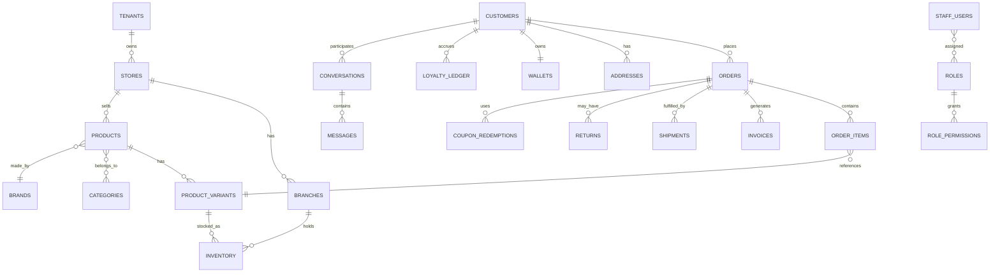

# 04 — Database Schema & Entity Relationships

**Document:** Nexo Platform SRS — Chapter 4
**Depends on:** Chapters 01–03
**Notation:** PostgreSQL-flavored pseudo-DDL. `id` columns are UUID v7 (time-sortable) unless noted. Every table has `created_at`, `updated_at` (and `deleted_at` for soft-delete where noted) omitted below for brevity except where semantically important. Every table includes `tenant_id` for row-level multi-tenant isolation unless it is itself tenant-global seed data (e.g., `currencies`, `permissions`).

---

## 4.1 Entity Relationship Overview (core domains)



## 4.2 Identity, Tenancy & RBAC

```sql
tenants (
  id, name, owner_staff_user_id, plan_id, region_pin, status ENUM('active','suspended','closed'),
  created_at, updated_at
)

stores (
  id, tenant_id, name, slug UNIQUE, primary_domain, default_country_id, default_currency_code,
  default_language_code, base_currency_code, status ENUM('active','inactive','archived')
)

branches (
  id, store_id, name, type ENUM('warehouse','retail','pickup_point','hybrid'),
  address_line1, address_line2, city, country_id, postal_code, lat, lng,
  timezone, phone, status
)

staff_users (
  id, tenant_id, email UNIQUE, phone, password_hash, is_owner BOOLEAN,
  status ENUM('active','suspended','invited','locked'), locale, timezone,
  two_factor_enabled BOOLEAN, two_factor_method ENUM('totp','sms'),
  last_login_at, failed_login_count, locked_until
)

staff_user_scopes (              -- which branches/stores a staff user is assigned to
  staff_user_id, scope_type ENUM('store','branch'), scope_id
)

roles (
  id, tenant_id NULL for system roles, name, rank INT, is_system BOOLEAN,
  version INT, created_by_staff_user_id
)

permissions (                    -- global seed catalog, not tenant-scoped
  id, resource, action, description
)

role_permissions (
  role_id, permission_id, scope_type ENUM('global','country','store','branch','self'),
  scope_id NULLABLE, conditions_json JSONB
)

staff_user_roles (
  staff_user_id, role_id
)

user_permission_overrides (
  id, staff_user_id, permission_id, effect ENUM('grant','deny'),
  scope_type, scope_id, expires_at, created_by_staff_user_id, reason
)

api_clients (                    -- OAuth2 client-credential apps / integrations
  id, tenant_id, name, client_id UNIQUE, client_secret_hash, scopes TEXT[],
  status, created_by_staff_user_id
)

sessions (
  id, principal_type ENUM('staff','customer'), principal_id, refresh_token_hash,
  device_fingerprint, ip_address, user_agent, expires_at, revoked_at
)
```

## 4.3 Customers & CRM

```sql
customers (
  id, tenant_id, store_id, email, phone UNIQUE(store_id, phone), password_hash NULLABLE,
  first_name, last_name, preferred_language, preferred_currency, marketing_opt_in BOOLEAN,
  whatsapp_opt_in BOOLEAN, status ENUM('active','blocked'), acquisition_source,
  loyalty_tier_id, created_at
)

addresses (
  id, customer_id, label, recipient_name, phone, country_id, city, address_line1,
  address_line2, postal_code, lat, lng, is_default_shipping, is_default_billing
)

customer_notes (                 -- internal staff notes, never shown to customer
  id, customer_id, author_staff_user_id, note, visibility ENUM('team','private')
)

customer_tags (
  customer_id, tag
)

leads (                          -- pre-customer CRM entity
  id, tenant_id, store_id, name, phone, email, source, stage ENUM('new','contacted','qualified','quoted','won','lost'),
  owner_staff_user_id, expected_value, converted_customer_id NULLABLE
)

interactions (                   -- unified timeline: calls, notes, status changes
  id, subject_type ENUM('customer','lead'), subject_id, staff_user_id, type ENUM('call','note','meeting','email','whatsapp','status_change'),
  content, occurred_at
)
```

## 4.4 Catalog: Products, Categories, Brands, Variants

```sql
brands (id, tenant_id, name, slug, logo_url, description)

categories (
  id, tenant_id, parent_id NULLABLE, name, slug, sort_order, image_url, is_active
)

products (
  id, tenant_id, store_id, brand_id NULLABLE, type ENUM('simple','variable','digital','bundle'),
  sku_prefix, status ENUM('draft','active','archived'), seo_title, seo_description,
  base_price_minor_units, cost_price_minor_units, tax_class_id, weight_grams, is_taxable
)

product_translations (
  product_id, language_code, name, description, short_description, seo_title, seo_description,
  PRIMARY KEY(product_id, language_code)
)

product_categories (product_id, category_id)

product_images (id, product_id, url, sort_order, alt_text)

product_options (id, product_id, name)               -- e.g., "Color", "Size"
product_option_values (id, product_option_id, value, sort_order)

product_variants (
  id, product_id, sku UNIQUE, barcode, price_minor_units_override, weight_grams_override, status
)

product_variant_option_values (product_variant_id, product_option_value_id)

product_store_visibility (product_id, store_id, is_active, price_override_minor_units)
product_country_restrictions (product_id, country_id, restriction_type ENUM('blocked','requires_license'))

product_bundles (bundle_product_id, component_product_variant_id, quantity)

reviews (
  id, product_id, customer_id, order_item_id, rating INT CHECK 1-5, title, body,
  status ENUM('pending','approved','rejected'), moderated_by_staff_user_id
)
```

## 4.5 Inventory, Warehouse, Suppliers

```sql
inventory (
  product_variant_id, branch_id, quantity_on_hand, quantity_reserved, quantity_incoming,
  reorder_point, reorder_quantity,
  PRIMARY KEY(product_variant_id, branch_id)
)

stock_movements (                -- append-only ledger, never updated in place
  id, product_variant_id, branch_id, quantity_delta, type ENUM(
    'sale','return','adjustment','transfer_in','transfer_out','purchase_receipt','initial'
  ), reference_type, reference_id, reason, performed_by_staff_user_id, created_at
)

suppliers (id, tenant_id, name, contact_email, contact_phone, address, payment_terms)

purchase_orders (
  id, tenant_id, supplier_id, branch_id, status ENUM('draft','submitted','partially_received','received','cancelled'),
  expected_at, created_by_staff_user_id
)

purchase_order_items (
  purchase_order_id, product_variant_id, quantity_ordered, quantity_received, unit_cost_minor_units
)

stock_transfers (
  id, from_branch_id, to_branch_id, status ENUM('pending','in_transit','completed','cancelled'),
  requested_by_staff_user_id, approved_by_staff_user_id
)

stock_transfer_items (stock_transfer_id, product_variant_id, quantity)

stock_counts (id, branch_id, status ENUM('open','reconciled'), started_by_staff_user_id, closed_at)
stock_count_items (stock_count_id, product_variant_id, counted_quantity, system_quantity, variance)
```

## 4.6 Orders, Checkout, Shipping, Tax, Payments

```sql
carts (
  id, customer_id NULLABLE, session_token NULLABLE, store_id, currency_code, country_id,
  status ENUM('active','converted','abandoned'), abandoned_notified_at
)
cart_items (cart_id, product_variant_id, quantity, price_minor_units_snapshot)

orders (
  id, tenant_id, store_id, branch_id, customer_id, order_number UNIQUE,
  status ENUM('pending','confirmed','processing','partially_shipped','shipped','delivered','completed','cancelled','refunded'),
  currency_code, exchange_rate_used, country_id,
  subtotal_minor_units, discount_minor_units, tax_minor_units, shipping_minor_units, total_minor_units,
  channel ENUM('storefront','whatsapp','pos','manual_admin'), placed_at
)

order_items (
  id, order_id, product_variant_id, sku_snapshot, name_snapshot, quantity,
  unit_price_minor_units, tax_minor_units, discount_minor_units, total_minor_units
)

order_status_history (order_id, from_status, to_status, changed_by_staff_user_id, note, created_at)

tax_classes (id, tenant_id, name)
tax_rules (id, tax_class_id, country_id, region_code NULLABLE, rate_percent, is_compound, priority)

shipping_zones (id, store_id, name, country_ids TEXT[])
shipping_methods (id, shipping_zone_id, name, carrier_id NULLABLE, base_cost_minor_units, cost_per_kg, free_over_minor_units)

carriers (id, tenant_id, name, api_provider ENUM('manual','aramex','dhl','custom'), credentials_ref)

shipments (
  id, order_id, carrier_id, tracking_number, status ENUM('label_created','picked_up','in_transit','out_for_delivery','delivered','failed','returned'),
  assigned_delivery_staff_user_id NULLABLE, cod_amount_minor_units NULLABLE, proof_of_delivery_url
)

payment_methods_config (id, store_id, provider ENUM('card','cod','bank_transfer','wallet','digital_wallet'), credentials_ref, is_active)

payments (
  id, order_id, provider, provider_reference, amount_minor_units, currency_code,
  status ENUM('pending','authorized','captured','failed','refunded','partially_refunded'), captured_at
)

invoices (
  id, order_id, invoice_number UNIQUE, type ENUM('invoice','credit_note'), status ENUM('issued','void'),
  pdf_url, issued_at, legal_entity_snapshot_json
)

returns (
  id, order_id, status ENUM('requested','approved','rejected','received','refunded'),
  reason_code, requested_by ENUM('customer','staff'), created_by_id
)
return_items (return_id, order_item_id, quantity, condition ENUM('sellable','damaged'))

refunds (id, order_id, return_id NULLABLE, amount_minor_units, method ENUM('original_payment','wallet','manual'), issued_by_staff_user_id, status)
```

## 4.7 Promotions, Loyalty, Wallet, Gift Cards

```sql
coupons (
  id, store_id, code UNIQUE, type ENUM('percent','fixed','free_shipping'), value,
  min_cart_amount_minor_units, usage_limit_total, usage_limit_per_customer,
  starts_at, ends_at, applicable_category_ids TEXT[], applicable_product_ids TEXT[], is_active
)
coupon_redemptions (coupon_id, order_id, customer_id, discount_applied_minor_units)

campaigns_offers (
  id, store_id, type ENUM('flash_sale','bundle','bogo','tiered_discount'), config_json,
  starts_at, ends_at, is_active
)

loyalty_tiers (id, store_id, name, min_points, perk_description)
loyalty_ledger (id, customer_id, delta_points, reason ENUM('purchase','review','referral','redemption','expiry','manual_adjustment'), reference_id, expires_at)

wallets (id, customer_id UNIQUE, currency_code, balance_minor_units)
wallet_transactions (id, wallet_id, delta_minor_units, type ENUM('topup','refund','redeem_points','purchase','manual_adjustment'), reference_id, created_by)

gift_cards (
  id, store_id, code UNIQUE, initial_balance_minor_units, current_balance_minor_units,
  currency_code, issued_to_customer_id NULLABLE, expires_at, status ENUM('active','redeemed','expired','disabled')
)
gift_card_redemptions (gift_card_id, order_id, amount_used_minor_units)
```

## 4.8 WhatsApp / Messaging / Omnichannel

```sql
whatsapp_accounts (id, store_id, waba_id, phone_number_id, display_phone_number, access_token_ref, status)

whatsapp_templates (
  id, whatsapp_account_id, name, category ENUM('marketing','utility','authentication'),
  language_code, body_json, meta_status ENUM('pending','approved','rejected','paused')
)

conversations (
  id, tenant_id, store_id, customer_id NULLABLE, channel ENUM('whatsapp','email','webchat','sms'),
  external_thread_id, status ENUM('open','pending','closed'), assigned_staff_user_id NULLABLE,
  first_response_due_at, last_message_at
)

messages (
  id, conversation_id, direction ENUM('inbound','outbound'), sender_type ENUM('customer','staff','bot','system'),
  sender_id NULLABLE, content_type ENUM('text','image','document','template','interactive','list','order','location'),
  content_json, whatsapp_message_id, status ENUM('sent','delivered','read','failed'), created_at
)

whatsapp_flows (id, whatsapp_account_id, flow_id_meta, name, status, version)

automation_rules (
  id, store_id, trigger ENUM('keyword','no_reply_timeout','order_status_change','cart_abandoned','office_hours'),
  trigger_config_json, action ENUM('send_template','send_text','assign_agent','tag_conversation','handoff_bot'),
  action_config_json, is_active, priority
)

bot_sessions (id, conversation_id, current_intent, context_json, handed_off_at NULLABLE)
```

## 4.9 Marketing Automation

```sql
segments (id, store_id, name, definition_json, is_dynamic BOOLEAN)   -- dynamic = live query, static = snapshot membership
segment_members (segment_id, customer_id)   -- used when is_dynamic = false

campaigns (
  id, store_id, name, channel ENUM('email','sms','whatsapp','push'), segment_id,
  status ENUM('draft','scheduled','sending','sent','paused'), scheduled_at_utc, template_ref
)
campaign_sends (id, campaign_id, customer_id, status ENUM('queued','sent','delivered','opened','clicked','failed','unsubscribed'))
```

## 4.10 Notifications, Audit, Monitoring

```sql
notification_templates (id, store_id, event_key, channel, language_code, subject, body)
notification_events (id, tenant_id, event_key, payload_json, created_at)
notification_deliveries (id, notification_event_id, channel, recipient, status, attempted_at, error)

audit_logs (                     -- append-only, no UPDATE/DELETE allowed at application layer; DB permission enforced
  id, tenant_id, actor_type ENUM('staff','customer','system','api_client'), actor_id,
  action, resource_type, resource_id, before_json, after_json, ip_address, user_agent,
  role_version_id NULLABLE, created_at
)

backups (id, tenant_id NULLABLE, type ENUM('full','incremental'), status, storage_url, size_bytes, started_at, completed_at)

alerts (id, rule_key, severity ENUM('info','warning','critical'), payload_json, acknowledged_by_staff_user_id, created_at)
```

## 4.11 Indexing & Performance Notes

- All tenant-scoped tables: composite index leading with `tenant_id` (and `store_id` where present), since every query is tenant-filtered by the RLS policy and application layer alike.
- `orders`: index on `(store_id, status, placed_at DESC)` for operational queues; `(customer_id, placed_at DESC)` for customer history.
- `stock_movements`: index on `(product_variant_id, branch_id, created_at DESC)`; this table is append-only and should be partitioned by month once volume justifies it.
- `audit_logs`: partitioned by month (range partition on `created_at`); indexed on `(tenant_id, resource_type, resource_id)` and `(actor_id, created_at DESC)`.
- `messages`: index on `(conversation_id, created_at)`; full-text search index (GIN, `to_tsvector`) on `content_json->>'text'` for CRM/Support search.
- Row-Level Security (RLS) policies enabled on every tenant-scoped table as defense-in-depth: `USING (tenant_id = current_setting('app.current_tenant_id')::uuid)`, set per-connection by the application at the start of each request.
- Money is **always** stored as integer minor units (`BIGINT`), never `FLOAT`/`NUMERIC` rounding ambiguity in application math — `NUMERIC` is acceptable at the DB column-type level but application arithmetic uses integer cents to avoid floating-point drift.

---

**Previous:** [03 — Multi-Tenancy & Globalization](./03-multi-tenancy-globalization.md) · **Next:** [05 — Catalog, Inventory & Warehouse](./05-catalog-inventory-warehouse.md)
