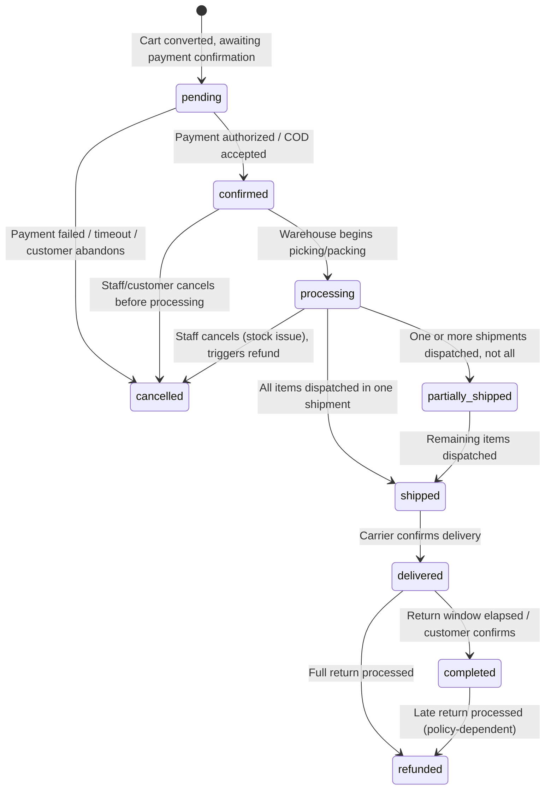
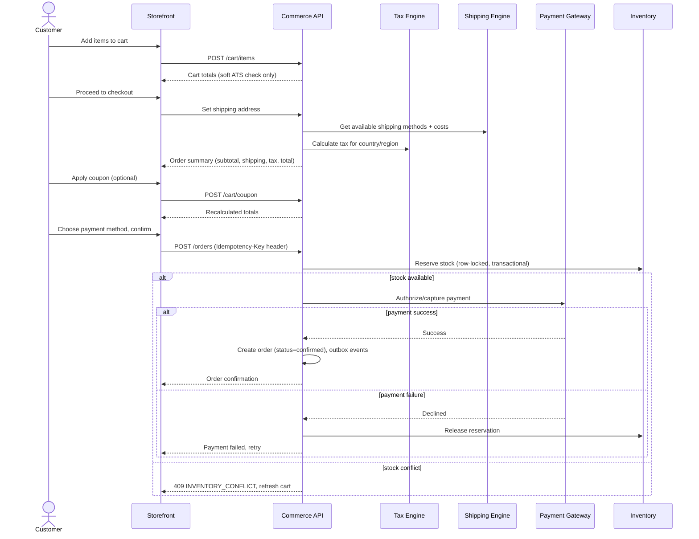
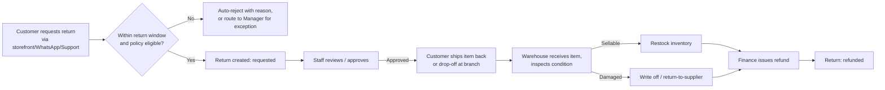

# 06 — Orders, Checkout, Shipping, Tax, Payments, Invoices, Refunds & Returns

**Document:** Nexo Platform SRS — Chapter 6
**Depends on:** Chapters 04–05

---

## 6.1 Order Lifecycle State Machine

**Business rules on transitions:**
- `pending → cancelled` after a configurable timeout (default 30 minutes) if payment is not confirmed — releases any soft holds, no inventory was ever hard-reserved at `pending` (see §5.2.2, reservation happens at `confirmed`).
- Only `confirmed` or later orders hold a hard inventory reservation; cancelling from `confirmed` or `processing` releases that reservation atomically with the status change (same transaction).
- `shipped → delivered` can be carrier-webhook-driven or manually confirmed by Delivery/Support after a grace period if the carrier never reports delivery (configurable fallback, e.g., auto-mark delivered 5 days after `shipped` for COD/local delivery flows with no tracking webhook).
- Cancellation after `processing` requires Manager+ approval if picking has started (prevents silent stock/labor waste) — enforced via RBAC `order.cancel` condition `status_at_least = processing`.

## 6.2 Cart & Checkout Flow

### 6.2.1 Checkout Business Rules

- Guest checkout is supported by default (configurable to require account creation), with an option to convert to a registered account post-purchase (pre-filled signup using order email).
- Cart merge on login: if a guest has items in a session cart and logs in with an account that also has a saved cart, the system merges by union of line items (summing quantities for identical SKUs) and asks the customer to confirm if there's a conflict (e.g., different selected variant of the same product).
- Address validation: format validation per country (postal code patterns, required fields vary — e.g., some countries have no postal code) via a country rules table, not hard-coded per-country logic in the frontend.
- Minimum order value, maximum order value (fraud guard), and maximum quantity per SKU per order are store-configurable business rules enforced server-side (never trust client-computed totals — server always recomputes from source prices/tax/shipping regardless of what the client displayed).
- **Idempotency**: order creation endpoint requires `Idempotency-Key`; a retried request with the same key returns the original order rather than creating a duplicate — critical for flaky mobile networks and double-tap submissions.
- The full checkout flow (reserve inventory → charge payment → create order → emit events) is implemented as an **orchestrated saga** (Chapter 1, §1.7): if payment fails after reservation, the saga's compensating action releases the reservation within the same request lifecycle (synchronous compensation) rather than relying on eventual consistency for the common failure path.

### 6.2.2 Manual/Admin-Created Orders (Sales role)

- Sales/Admin can create an order on behalf of a customer (phone/WhatsApp orders): same validation pipeline as storefront checkout, but payment can be marked `pending_manual` (e.g., "will pay on delivery" or "invoice sent") — these still go through the same inventory reservation and tax/shipping calculation logic, no bypass path exists that skips stock/tax rules.
- Manual orders record `channel = 'manual_admin'` and `created_by_staff_user_id` for attribution and commission/quota tracking (Sales dashboard, Chapter 2).

## 6.3 Tax Engine

- Tax calculation resolves the applicable `tax_rules` row by `(product.tax_class_id, order.country_id, region_code)`, ordered by `priority`, supporting compound taxes (e.g., a federal + regional tax stacking).
- Prices can be configured store-wide as **tax-inclusive** (common in VAT countries, e.g., displayed price already contains tax, shown itemized at checkout) or **tax-exclusive** (common in the US, tax added at checkout) — this is a per-store, per-country setting, not global.
- **Tax exemptions**: B2B customers with a valid tax-exemption certificate (e.g., resale certificate) can be flagged `tax_exempt = true` on their customer record; orders for exempt customers skip tax calculation but retain an audit note referencing the certificate.
- **Digital goods** may have different tax treatment (e.g., EU VAT MOSS-style rules based on customer's declared country rather than seller's) — modeled via a `tax_class` specific to digital products with its own rule set.
- Tax amount is **locked onto the order** at confirmation (`order_items.tax_minor_units`); subsequent tax-rate changes never retroactively alter historical orders/invoices.

## 6.4 Shipping Engine

### 6.4.1 Rate Calculation

- A store defines **Shipping Zones** (sets of countries/regions) each with one or more **Shipping Methods** (flat rate, weight-based, price-based free-shipping threshold, or live-rate via carrier API).
- At checkout, the engine filters methods by: zone match for the destination, cart weight/dimensions, and cart subtotal (for free-shipping thresholds); live-rate methods call the carrier's rate API synchronously with a strict timeout (e.g., 2s) and graceful fallback to a configured flat rate if the carrier API is slow/unavailable (never block checkout on a third-party outage).
- **Click & Collect / Pickup**: a special shipping method type tied to a specific branch; selecting it skips shipment creation for carrier purposes but still creates a `shipments` record with `carrier_id = null` and a branch-pickup status flow (`ready_for_pickup → picked_up`).

### 6.4.2 Carrier Integration

- Each `carriers` record wraps a carrier-specific adapter implementing a common interface: `createLabel(order)`, `getRates(origin, destination, weight)`, `trackShipment(tracking_number)`, `cancelLabel()`.
- Adapters isolate carrier-specific auth/payload quirks so the Shipping module core never branches on carrier identity outside the adapter layer (Strategy pattern) — adding a new carrier means adding a new adapter, not modifying core logic.
- Webhook or polling-based tracking updates flow into `shipments.status` and cascade to `orders.status` (e.g., carrier "delivered" event → order `delivered`), recorded in `order_status_history` with `changed_by_staff_user_id = null` (system-attributed) and the carrier event payload retained for dispute resolution.
- **COD (Cash on Delivery)**: `shipments.cod_amount_minor_units` set at label creation; Delivery role dashboard tracks collected-vs-reconciled COD totals per agent per day (Chapter 2, §2.4.10); a reconciliation record is required before a delivery agent's shift/day is "closed" in the system (Finance visibility into any variance).

## 6.5 Payments

- Payment providers integrated via an adapter pattern identical in spirit to shipping carriers: `authorize()`, `capture()`, `refund()`, `void()`, each adapter normalizing provider-specific response codes into Nexo's internal `payments.status` enum.
- **PCI-DSS scope minimization**: card data is never touched by Nexo's own servers — checkout uses the gateway's hosted fields / tokenization SDK (e.g., iframe/drop-in) so raw PAN never transits Nexo's backend; only a payment token/reference is stored (see Chapter 13 for full compliance detail).
- **Authorize vs. Capture**: default flow is auth-at-checkout, capture-at-shipment (common for stores that don't want to charge before fulfillment is guaranteed); configurable per store to capture immediately instead. Authorization holds have expiry (typically 7 days per card networks) — a background job monitors `authorized` payments approaching expiry and alerts Finance/Admin to re-authorize or cancel the order.
- **Partial capture / partial refund**: supported at the line-item level (e.g., one item out of stock post-confirmation gets refunded while the rest ships) — `payments` can have multiple associated `refunds` rows summing to ≤ the captured amount.
- **Wallet and Gift Card as payment methods**: applied first against the order total before the remaining balance is charged to the primary payment method (split payment); `wallet_transactions`/`gift_card_redemptions` created atomically with the order in the same transaction as the primary payment authorization — if the primary payment fails, the wallet/gift-card debit is rolled back too (all-or-nothing).

## 6.6 Invoices

- An invoice is generated automatically on order confirmation (configurable: on confirmation vs. on shipment, per country's legal requirement — some jurisdictions require invoicing only on fulfillment).
- Invoice numbering is **sequential and gapless per legal entity** (per country/store, depending on how the tenant's legal entities map to stores) — required for tax authority compliance in many countries; numbering is generated inside the same DB transaction as invoice creation using a dedicated sequence to avoid gaps from rolled-back transactions.
- `legal_entity_snapshot_json` captures the seller's registered name/address/VAT number **at time of issue** so historical invoices remain accurate even if the seller's registration details change later.
- **Credit notes** (`invoices.type = 'credit_note'`) are issued for refunds/returns, always referencing the original invoice number — invoices are never edited or deleted post-issue (`status = 'void'` is the only mutation, itself requiring Finance role and a reason, and a void does not remove the original document, only marks it superseded — full immutability for audit).
- PDF generation is an async worker job (queued on invoice creation) rendering from a per-country/per-language template; stored in object storage with a signed URL for customer download.

## 6.7 Refunds & Returns (RMA)

### 6.7.1 Return Workflow

### 6.7.2 Business Rules & Edge Cases

- Return eligibility is policy-driven per store/category (e.g., electronics 7 days, apparel 30 days, final-sale items non-returnable) — checked automatically, but Manager/Admin can override with an explicit "exception" flag that's separately reportable (to monitor policy-erosion patterns).
- Partial returns (some items from a multi-item order) are fully supported at the `order_item` granularity; refund amount recalculates proportionally including per-item tax and any coupon discount originally allocated to that item (discount allocation must be stored per line item at order time specifically to make this possible, not just as an order-level lump sum).
- Refund method defaults to original payment method; store policy can allow customer's choice of wallet credit instead (often incentivized with a bonus, e.g., "refund to wallet gets 5% extra") — this is a Marketing-configurable incentive, not core logic.
- **Fraud guard**: customers with an unusually high return rate (configurable threshold) are flagged on their CRM profile for Support/Finance visibility; does not auto-block but surfaces context when the next return request comes in.
- A return cannot be created for an order that was never `delivered` (or `completed`) — enforced server-side regardless of what UI state the client thinks it's in.
- Refund issuance is idempotent per return (a `return_id` can only be fully refunded once; re-submitting the refund action returns the existing refund record rather than double-refunding) — same `Idempotency-Key` discipline as order creation.

## 6.8 API Endpoints (Orders/Checkout/Fulfillment/Finance)

| Method | Path | Auth | Description |
|---|---|---|---|
| POST | `/api/v1/storefront/cart/items` | Public/Customer | Add/update cart item |
| POST | `/api/v1/storefront/cart/coupon` | Public/Customer | Apply coupon |
| GET | `/api/v1/storefront/checkout/shipping-methods` | Public/Customer | Get available methods + cost |
| POST | `/api/v1/storefront/orders` | Customer (Idempotency-Key required) | Create order from cart |
| GET | `/api/v1/storefront/orders/{id}` | Customer (owns order) | Order status/detail |
| GET | `/api/v1/admin/orders` | Staff (`order.view`) | List/filter/search orders |
| POST | `/api/v1/admin/orders/{id}/cancel` | Staff (`order.cancel`) | Cancel with reason, releases stock |
| POST | `/api/v1/admin/orders/{id}/status` | Staff (`order.update`) | Manual status transition |
| POST | `/api/v1/admin/shipments/{id}/status` | Staff/Delivery (`shipment.update`, self-scope for Delivery) | Update shipment status, capture POD |
| POST | `/api/v1/admin/returns` | Staff or Customer | Create RMA |
| POST | `/api/v1/admin/returns/{id}/approve` | Staff (`return.approve`) | Approve/reject |
| POST | `/api/v1/admin/returns/{id}/receive` | Staff (`return.update`, Warehouse) | Log inspection outcome |
| POST | `/api/v1/admin/refunds` | Staff (`refund.issue`, conditions apply) | Issue refund (Idempotency-Key required) |
| GET | `/api/v1/admin/invoices/{id}/pdf` | Staff or Customer (own) | Signed download URL |
| POST | `/api/v1/admin/invoices/{id}/void` | Staff (`invoice.void`, Finance) | Void + auto credit note |

## 6.9 User Stories

- *As a Customer, if I lose connectivity right after tapping "Place Order" and retry, I want to see my original order confirmation, not be charged twice.*
- *As Finance, I want every refund to be traceable to the exact return/order/line item, with the tax portion broken out, so month-end reconciliation matches to the cent.*
- *As a Delivery agent, I want to mark a delivery as failed with a required reason (customer unavailable, wrong address, refused) so Support has context for the next contact attempt.*

---

**Previous:** [05 — Catalog, Inventory & Warehouse](./05-catalog-inventory-warehouse.md) · **Next:** [07 — Promotions, Loyalty, Wallets & Gift Cards](./07-promotions-loyalty-wallets-giftcards.md)
