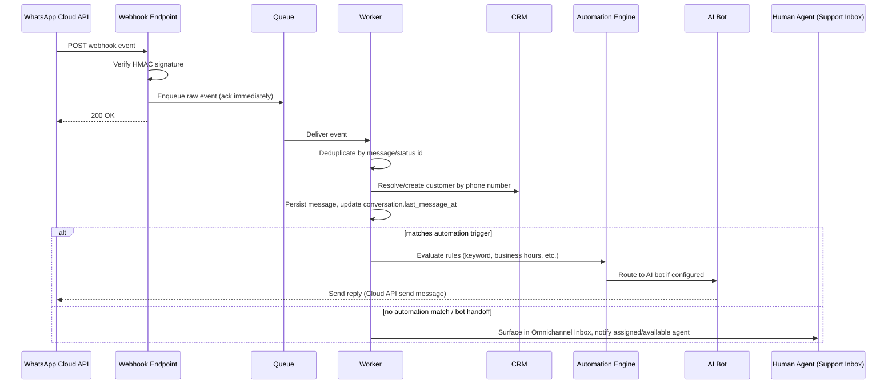

# 08 — WhatsApp Business Platform (Cloud API) Integration

**Document:** Nexo Platform SRS — Chapter 8
**Depends on:** Chapters 04, 06, 07
**Priority:** Core differentiator — treat as a first-class commerce channel, not a bolt-on notification tool.

---

## 8.1 Overview & Design Principles

Nexo integrates directly with **Meta's WhatsApp Business Platform (Cloud API)** — not a third-party BSP UI wrapper — so the platform owns the full data model and can build commerce-native experiences (catalog, cart-in-chat, order tracking) beyond generic messaging tools. A BSP (Business Solution Provider) may still sit underneath for phone number provisioning/hosting in markets where direct Meta onboarding is impractical, but Nexo's integration layer talks the **Cloud API contract** so switching BSP is an infrastructure change, not an application rewrite.

Design principles:
1. **Multi-number support**: a tenant can register multiple WhatsApp Business Accounts (WABAs)/phone numbers, one or more per store, for regional numbers or department routing.
2. **Async-first**: every inbound webhook is acknowledged to Meta within its required timeout and processed asynchronously via the queue (Chapter 1, §1.7) — never do slow work (AI inference, DB writes with side effects) synchronously inside the webhook handler.
3. **Template governance**: templates go through an internal approval workflow before submission to Meta, since Meta's own approval can take hours/days and rejected templates burn quality rating.
4. **Conversation state lives in Nexo**, not in Meta — Nexo is the system of record for conversation history, CRM linkage, and analytics; Meta's API is a transport, not a database.

## 8.2 Account & Number Setup

- Onboarding flow (Super Admin/Admin): connect via **Embedded Signup** (Meta's OAuth-based flow) to obtain a WABA ID, phone number ID, and a long-lived system-user access token — stored encrypted (Chapter 13, secrets management), never in plaintext config.
- Number verification, display name approval, and business profile (photo, description, category, address) are managed from a Nexo settings screen that proxies to the relevant Graph API calls, so staff never need to touch Meta Business Manager directly for routine changes.
- **Quality rating & messaging limits** (Meta enforces tiered daily conversation limits per number based on quality) are polled and surfaced on the Marketing/Super Admin dashboard with proactive alerts if quality drops to "Medium"/"Low", since this directly throttles marketing reach.

## 8.3 Webhooks

### 8.3.1 Endpoint Contract

- `GET /api/v1/integrations/whatsapp/webhook` — verification handshake (`hub.mode`, `hub.verify_token`, `hub.challenge`) performed once per app configuration.
- `POST /api/v1/integrations/whatsapp/webhook` — receives all events: inbound messages, message status updates (sent/delivered/read/failed), template status changes, account alerts.

### 8.3.2 Security

- Every inbound POST is verified against the `X-Hub-Signature-256` header using the app secret (HMAC-SHA256) **before** any payload parsing — requests failing verification are rejected with 403 and logged as a potential spoofing attempt (Chapter 13).
- The webhook endpoint responds `200 OK` immediately after signature verification and enqueueing the raw payload — target under 1 second — with all business logic (matching to conversation, CRM lookup, automation rule evaluation, AI inference) handled by a worker consuming from the queue, decoupling Nexo's processing time from Meta's retry/timeout behavior.
- Webhook payloads are idempotency-keyed by Meta's `message.id` / `status.id` to safely handle Meta's at-least-once delivery guarantee (duplicate webhook deliveries must not create duplicate `messages` rows or double-fire automations).

### 8.3.3 Processing Pipeline

## 8.4 Message Types Supported

| Type | Direction | Use Case |
|---|---|---|
| Text | In/Out | Free-form conversation |
| Media (image/video/document/audio) | In/Out | Product photos, receipts, ID verification for support |
| Template (HSM) | Out only, first contact / outside 24h window | Order confirmations, shipping updates, marketing blasts |
| Interactive — Reply Buttons | Out (customer taps to reply) | "Track Order" / "Talk to Agent" / "Cancel Order" quick actions |
| Interactive — List Messages | Out | "Choose a category", "Select support topic", multi-section menus |
| Interactive — Product / Product List (Catalog) | Out | Single product card or multi-product carousel from the connected catalog |
| Interactive — Flows | Out/In (structured multi-step form inside WhatsApp) | Checkout-in-chat, address collection, feedback surveys, appointment booking |
| Location | In/Out | Customer shares delivery location; store shares branch location |
| Contacts | In | Occasionally used for referral capture |
| Order (native WhatsApp cart) | In | Customer builds a cart via the Catalog and sends it as an "order" message |

## 8.5 The 24-Hour Customer Service Window & Template Rules

- Meta restricts free-form (non-template) messages to within **24 hours of the customer's last inbound message**. Nexo's Messaging module enforces this at the send layer: any attempt to send a non-template message outside the window is automatically rejected with a clear error to the sending agent/system, and the UI proactively disables the free-text composer (showing only "Send Template" option) once the window has closed, so agents are never surprised by a Meta-side rejection.
- **Template categories**: `MARKETING`, `UTILITY`, `AUTHENTICATION` — Nexo's Marketing dashboard (Chapter 9) enforces that marketing sends only use `MARKETING`-category templates (Meta's policy and pricing differ by category; misclassification risks account restriction).
- Template lifecycle: **Draft (internal) → Submitted → Meta Pending → Approved/Rejected → (optionally) Paused/Disabled** by Meta for quality issues. Nexo polls/receives webhook updates for `meta_status` and surfaces rejection reasons directly in the template editor so Marketing can revise and resubmit without leaving Nexo.
- Variable placeholders (`{{1}}`, `{{2}}`...) map to named, typed fields in Nexo's template builder (e.g., `{{customer_name}}`, `{{order_number}}`) to prevent send-time errors from mismatched variable counts — validated at send time against the actual payload before calling the Cloud API.

## 8.6 Interactive Messages, List Messages & Flows — Implementation Detail

- **Reply Buttons** (max 3 per Meta's limit): modeled in `automation_rules`/message templates as `{type: 'button', buttons: [{id, title}]}`; button taps arrive as inbound interactive replies keyed by `id`, routed back into the automation/bot engine as a structured intent rather than free text — avoids re-running NLU on an unambiguous button tap.
- **List Messages** (up to 10 rows across sections): used for structured menus — e.g., Support topic selection ("Order Issue", "Product Question", "Return Request") each row mapped to an internal action (assign to queue, trigger automation, open a Flow).
- **WhatsApp Flows**: used for structured data collection beyond simple buttons — e.g., a full checkout form (address, payment method selection) or a CSAT survey. Nexo's Flow Builder (Marketing/Super Admin) produces the Flow JSON, publishes it via the Flows API, and maps completed Flow responses back into Nexo entities (e.g., a completed "Checkout Flow" response creates a `cart`/`order` exactly as the storefront checkout would, going through the same validation/reservation/payment pipeline described in Chapter 6 — **no parallel, less-validated order-creation path for WhatsApp orders**).

## 8.7 Product Catalog & Commerce Features

- Nexo syncs its `products`/`product_variants` (Chapter 4/5) to a **Meta Commerce Catalog** via the Catalog Batch API, keyed by SKU (`retailer_id`); sync runs on product publish/update/price-change/archive, with a reconciliation job run periodically to catch drift (rate-limited to Meta's batch API quotas, with a backoff/retry queue for failures).
- Catalog visibility per store respects `product_store_visibility` (Chapter 3/4) — a product not visible in a given store never syncs to that store's connected catalog.
- **Product/Product-List messages**: agents or automations can send a single product card or a curated multi-item list directly in chat, sourced live from Nexo's catalog (not a stale copy) at send time.
- **Native WhatsApp Cart & Order messages**: when a customer adds items via the catalog inside WhatsApp and sends their cart, Meta delivers an "order" message containing the selected `retailer_id`s and quantities; Nexo's webhook processor maps these back to `product_variants` and creates a **pending cart** attributed to `channel = 'whatsapp'`, then proceeds through Nexo's standard checkout/payment flow (payment link sent back via WhatsApp, or COD confirmation via a template + button) — reusing the exact same order pipeline as Chapter 6, ensuring inventory, tax, and shipping rules are identical regardless of channel.
- **Click to WhatsApp (CTWA) Ads**: Nexo captures the `referral` object present on the first inbound message from a CTWA-originated conversation (ad id, ad headline, source URL) and attaches it to the `conversations`/`leads` record for attribution — feeding both CRM (Chapter 9) and marketing ROI reporting (Chapter 11) so ad spend can be tied to resulting conversations and orders.

## 8.8 Automated Conversations & AI-Powered Replies

### 8.8.1 Automation Rule Engine

- Rules (`automation_rules`, Chapter 4) are evaluated in priority order on each inbound event: `keyword` match (with simple pattern or NLU intent match), `no_reply_timeout` (e.g., escalate if unanswered for 10 minutes during business hours), `order_status_change` (proactively message the customer), `cart_abandoned` (see §8.9), `office_hours` (auto-reply outside working hours with expected response time, using the **branch/store's business calendar**, not server time — Chapter 3, §3.5).
- Rules can chain actions: send a template, tag the conversation, assign to a specific agent/team/queue (round-robin or skill-based), or hand off to the AI bot.

### 8.8.2 AI-Powered Bot

- **NLU/LLM-backed intent resolution** for common queries: order status ("where is my order #1234"), product availability/price, store hours/location, return policy — answered directly from live Nexo data (order/product APIs), not hallucinated from the model alone; the bot is architected as a **retrieval-augmented** assistant: intent/entities extracted by the LLM, actual facts fetched from Nexo's own services, and the LLM only used to phrase the response naturally in the customer's language.
- **Multi-language**: the bot detects/responds in the customer's message language, using the same translation infrastructure as the rest of the platform (Chapter 3) for canned/templated portions, and the LLM's native multilingual capability for freeform phrasing.
- **Confidence-based handoff**: if intent confidence is below a threshold, or the customer explicitly asks for a human ("agent", "human", "مندوب"), or a configured max bot-turn count is reached without resolution, the bot performs a **warm handoff**: tags the conversation, assigns to an available Support agent, and posts a concise AI-generated summary of the conversation so far into the agent's inbox view (not making the agent re-read the whole thread).
- **Guardrails**: the bot never fabricates order/payment/refund actions — it can *propose* an action (e.g., "I can process this return for you, confirm?") but any state-mutating action (issuing a refund, cancelling an order) still goes through the exact same RBAC-guarded service calls as a human agent would use, with the bot acting under a scoped **service principal** whose permissions are deliberately narrower than a human Support agent's (Chapter 2, §2.5) — e.g., bot can create a return request but cannot approve refunds above a small auto-approval ceiling.
- All bot messages are marked `sender_type='bot'` in `messages` (Chapter 4) and visible in the conversation history identically to human messages, for full transparency and QA review by Marketing/Support leads.

## 8.9 Abandoned Cart Recovery via WhatsApp

- A cart is flagged `abandoned` by a scheduled job if inactive for a configurable period (e.g., 1 hour) with items still present and no completed order.
- If the customer has `whatsapp_opt_in = true` and a verified phone number linked (from account or a captured number during an earlier WhatsApp interaction), Nexo sends a **UTILITY or MARKETING template** (category depends on whether it's inside/outside the 24h window and local regulatory guidance) reminding them of their cart, optionally with a product-list message showing the exact items and a "Complete your order" button deep-linking back to a pre-filled checkout (or directly into a Flow to complete checkout in-chat).
- Escalation sequence is configurable (e.g., reminder at 1h, incentive — dynamically generated coupon — at 24h, final reminder at 72h) with a hard stop after N attempts and automatic suppression if the customer completes the order or explicitly opts out at any point (opt-out is immediate and binding — checked before every automated send, not just at campaign creation).
- Recovery attribution: an order completed within a configurable window after a recovery message is tagged `recovered_via = 'whatsapp_abandoned_cart'` for funnel reporting (Chapter 9/11).

## 8.10 Order Tracking & Proactive Notifications via WhatsApp

- Order lifecycle events (Chapter 6, §6.1) publish outbox events consumed by the Notifications module (Chapter 10); WhatsApp is a first-class channel alongside email/SMS, using approved UTILITY templates: order confirmed, shipped (with tracking link/button), out for delivery, delivered, refund issued.
- Customers can reply to any of these proactive messages within the 24h window to ask follow-up questions, which routes into the normal inbound pipeline (§8.3.3) attached to the same conversation thread — order-triggered messages and support conversations are **not** separate silos; they share one conversation per customer per WhatsApp number.

## 8.11 Customer Support via WhatsApp (ties into Chapter 9)

- Every WhatsApp conversation appears in the Omnichannel Inbox (Chapter 9) alongside email/webchat/SMS, with full parity of features (assignment, tags, SLA, canned responses) — WhatsApp is not a second-class channel with a separate, lesser UI.
- Media received from customers (e.g., a photo of a damaged product for a return claim) is stored in object storage and linked to the relevant `return`/`order` record directly from the conversation view, so Support doesn't need to manually re-upload attachments elsewhere.

## 8.12 Business Rules & Edge Cases

- A phone number can only be linked to one `whatsapp_accounts` record system-wide (Meta constraint); Nexo validates and surfaces a clear error if an admin attempts to connect an already-registered number.
- If a customer messages a number that isn't yet mapped to any store/branch routing rule (e.g., new number, routing not configured), the conversation is queued to a default "Unrouted" inbox visible to Super Admin/Admin rather than silently dropped.
- Template message send failures (e.g., customer has blocked the business, invalid number) update `messages.status = 'failed'` with the Meta error code retained, and trigger a fallback per store configuration (e.g., fall back to SMS for critical transactional messages like OTP/order confirmation) — see Chapter 10 for the multi-channel fallback engine.
- Rate limits / messaging tier limits from Meta are respected by the outbound queue (Chapter 1) via a token-bucket limiter per WABA; when near the limit, non-critical (marketing) sends are deprioritized/queued behind transactional sends.
- GDPR/consent: `customers.whatsapp_opt_in` must be explicit (no pre-ticked boxes); marketing template sends check this flag at send time, not just at campaign creation, since opt-out can happen between scheduling and sending.
- Multi-agent collision: if two agents open the same conversation simultaneously, the UI shows a "currently viewed/being answered by X" indicator and soft-locks reply composition to prevent duplicate/conflicting responses to the customer.

## 8.13 API Endpoints (Nexo-side, wrapping Cloud API)

| Method | Path | Auth | Description |
|---|---|---|---|
| GET/POST | `/api/v1/integrations/whatsapp/webhook` | Meta signature | Inbound webhook (verification + events) |
| POST | `/api/v1/admin/whatsapp/accounts` | Staff (`integration.manage`, Super Admin) | Connect a WABA/number via Embedded Signup |
| GET | `/api/v1/admin/whatsapp/templates` | Staff (`whatsapp_template.view`) | List templates + Meta approval status |
| POST | `/api/v1/admin/whatsapp/templates` | Staff (`whatsapp_template.manage`) | Create + submit template |
| POST | `/api/v1/admin/whatsapp/flows` | Staff (`whatsapp_template.manage`) | Create/publish a Flow |
| POST | `/api/v1/admin/conversations/{id}/messages` | Staff/Bot (`conversation.reply`) | Send message (text/template/interactive) |
| POST | `/api/v1/admin/conversations/{id}/assign` | Staff (`conversation.assign`) | Assign to agent/team |
| POST | `/api/v1/admin/automation-rules` | Staff (`automation.manage`, Marketing/Super Admin) | CRUD automation rules |
| GET | `/api/v1/admin/whatsapp/catalog-sync-status` | Staff (`integration.view`) | Catalog sync health/errors |

---

**Previous:** [07 — Promotions, Loyalty, Wallets & Gift Cards](./07-promotions-loyalty-wallets-giftcards.md) · **Next:** [09 — CRM, Omnichannel Inbox & Marketing Automation](./09-crm-omnichannel-marketing.md)
